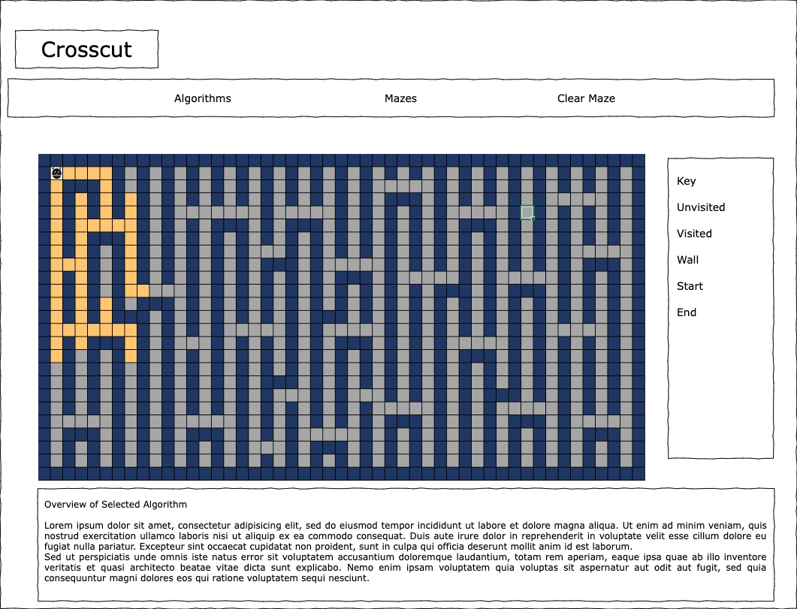

# Crosscut

## Overview 

Crosscut, at it's core is a visualizer for pathfinding algorithms, and users will be able to select different algorithms and see our protagonist in action as it tries to escape our maze. 
The user will also have the option to interact with the maze. The role of the user being the villian! The objective is to try and anticipate how our protagonist is going to search the labyrinth you have designed, and what the escape path will look like. Obviate the search before our protagonist can escape. 

## Functionality and MVPs

- Select from different algorithms: 
- Draw or generate the maze
- Utilize elements in the maze to slow down the search

## Wireframe

Frontend Setup

## Technologies, Libraries, APIs

- Vanila JS for logic/animations, CSS for styling, HTML canvas
- Webpack to bundle and transpile the source JavaScript code
- npm to manage project dependencies 

## Implementation Timeline

- Friday/Weekend: 
    - Plan to panic on Wednesday
    - Setup project with webpack and basic styling
    - Create the Maze and Node classes along with unweighted algorithms 
- Monday: 
    - Have a false sense of security
    - Incorporate unweighted algorithms and maze design/generation
    - Begin working on animations
- Tuesday:
    - Begin to stress about how much more complicated this actually is
    - Finish animations
    - Time permitting, incorporate interactive elements
- Wednesday:
    - Realize you are no where near you want to be for this project and start deconstructing the parts that aren't working. 
    - Spend some time feeling an immense amount of self-hatred 
    - Add finishing touches and work out the bugs
- Thursday: 
    - Wake up in a state of confusion and panic, as you wrap up the project to submit. 

